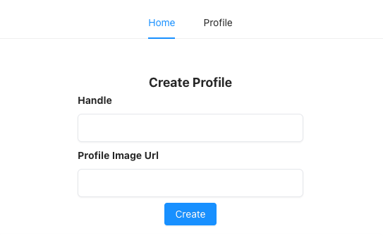
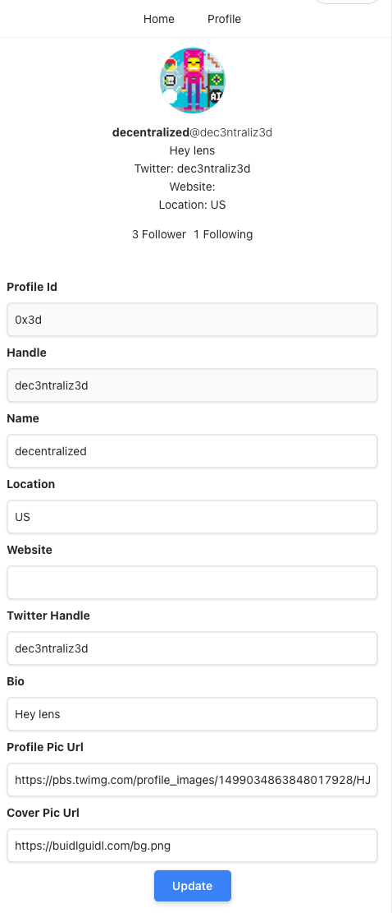

# 🏗 Buidlguidl-Lens ( Lens protocol boiler-plate with Typescript)

### [Mumbai Live Demo](https://buidlguidl-lens.surge.sh "Lens Protocol Boilerplate")






## Typescript

This is the typescript repo of scaffold.eth. The directories that you'll use are:

```bash
packages/vite-app-ts/
packages/hardhat-ts/
```

## Quick Start

Running the app

1. install your dependencies

   ```bash
   yarn install
   ```

2. Change network, infura key , burner wallet config in /packages/vite-app-ts/.env file.

   VITE_APP_TARGET_NETWORK=mumbai
   HARDHAT_TARGET_NETWORK=mumbai

3. run the app, `open a new command prompt`

   ```bash
   # build hardhat & external contracts types
   yarn contracts:build
   # start vite
   yarn start
   ```

## Overview

This repo extensively uses Lensprotocol api. Please check all documentations at
https://docs.lens.dev/docs

## Guides

- Check out [eth-hooks docs](https://scaffold-eth.github.io/eth-hooks/docs/overview) for example of how to use hooks
- you can look at [speedrun ethereum](https://speedrunethereum.com/) to get started with scaffold-eth-typescript and web3.
  - 🏁 Make sure to click on the typescript tab!

## More Information!

### 📚 Documentation

Documentation, tutorials, challenges, and many more resources, visit: [docs.scaffoldeth.io](https://docs.scaffoldeth.io)

Eth-hooks documentation is [here](https://scaffold-eth.github.io/eth-hooks/). Learn how to use the contexts here.

### 🔭 Learning Solidity

Read the docs: https://docs.soliditylang.org

Go through each topic from [solidity by example](https://solidity-by-example.org) editing `YourContract.sol` in **🏗 scaffold-eth**

### 🏃💨 Speedrun Ethereum

Register as a builder [here](https://speedrunethereum.com) and start on some of the challenges and build a portfolio.

### 🛠 Buidl

Check out all the [active branches](https://github.com/austintgriffith/scaffold-eth/branches/active), [open issues](https://github.com/austintgriffith/scaffold-eth/issues), and join/fund the 🏰 [BuidlGuidl](https://BuidlGuidl.com)!

[Follow the full Ethereum Speed Run](https://medium.com/@austin_48503/%EF%B8%8Fethereum-dev-speed-run-bd72bcba6a4c)

### 💌 P.S.

You need an RPC key for testnets and production deployments, create an [Alchemy](https://www.alchemy.com/) account and replace the value of `ALCHEMY_KEY = xxx` in `packages/react-app/src/constants.js` with your new key.

### 💬 Support Chat

Join the telegram [support chat 💬](https://t.me/joinchat/KByvmRe5wkR-8F_zz6AjpA) to ask questions and find others building with 🏗 scaffold-eth!

### 🙏🏽 Support us!

Please check out our [Gitcoin grant](https://gitcoin.co/grants/2851/scaffold-eth) too!
